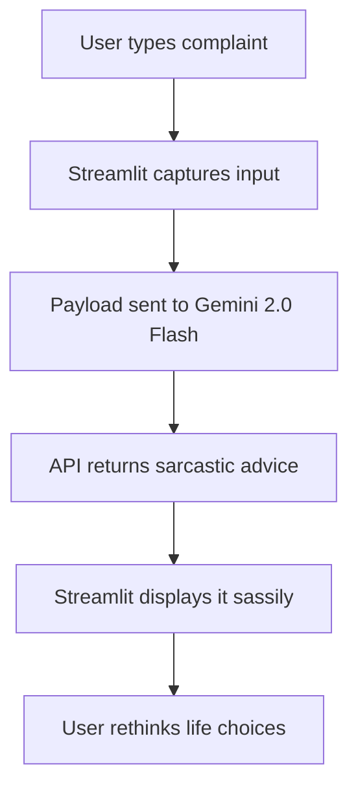

# 🧠 Sarcastic Self-Help Guru 🤖  
Because what you *really* needed today… was more unsolicited advice (but like, with attitude).

Welcome to your personal AI-powered therapist who has zero chill and no interest in toxic positivity. Built using **Google’s Gemini 2.0 Flash API** + **Streamlit**, this chatbot delivers snark, sass, and (accidentally?) helpful advice.

---

## 💡 Why This Exists

You’ve seen *too much* of “Believe in yourself!” energy.  
This one’s different. It says things like:

> “Sure, chase your dreams. What’s the worst that could happen? Probably everything.”

Yes — it’s sarcastic, cynical, and still gives you the existential slap you probably needed.

---

## ⚙️ Tech Stack

| Layer              | Tech Used                   |
|--------------------|-----------------------------|
| 💬 Chat Engine      | Gemini 2.0 Flash API         |
| 🖼️ UI Framework     | Streamlit                   |
| 🔐 Secret Handling  | `.env` + `python-dotenv`    |
| 🔁 API Access       | `requests` Python library   |
| 👻 Personality      | Dark humor + Gen-Z memes    |

---

## 🧠 How It Works (Project Architecture)

```
User Input
   ⬇
Streamlit Frontend (`app.py`)
   ⬇
Gemini API Call (via POST request)
   ⬇
Witty Burn is Returned
   ⬇
Streamlit UI Displays the Damage
```

---

## 🧾 Flowchart



---

## 🧪 Example Prompt & Output

**User:** “I feel stuck in life.”  
**Guru:** “Shocker. You and 7 billion others. Have you tried turning yourself off and on again?”

---

## 🛠️ Setup Guide (For Humans, Not Robots)

### 1. Clone the repo

```bash
git clone https://github.com/yourusername/sarcastic-guru-chatbot.git
cd sarcastic-guru-chatbot
```

### 2. Install the dependencies

```bash
pip install -r requirements.txt
```

### 3. Add your **Gemini API key**

Create a `.env` file (and don't share it with your crush):

```
GEMINI_API_KEY=your_actual_api_key_here
```

Make sure `.env` is in `.gitignore`. Your API key deserves privacy.

### 4. Run the app locally

```bash
streamlit run app.py
```

Boom. It’s live. You’re being roasted by AI.

---

## 🧾 File Structure

```
📦 sarcastic-guru-chatbot/
├── app.py               # Streamlit frontend
├── .env                 # Your Gemini API key (NOT committed)
├── .gitignore           # Ignores .env
├── requirements.txt     # All the pip magic
└── README.md            # This beauty
```

---

## 🔐 API Key Security (No Leaks Here)

> 🛑 Do NOT commit `.env` to GitHub.  
We’re keeping things 🔐 secure by adding it to `.gitignore`.

---

## 📈 Features To Add (or not, we’re lazy)

- [ ] Streamlit Cloud Deployment  
- [ ] Voice-to-sarcasm converter  
- [ ] Mood detection and moodier responses  
- [ ] Burn severity meter (1–💀)

---

## 🤝 Contributions Welcome

Got jokes? Better burns? Open a PR and make this chatbot spicier.  
Just keep it human-ish and not *too* evil.

---

## ✨ Built by

**Kriti Gupta** – powered by caffeine, sarcasm, and a bit too much AI.  
Check her out at [your GitHub profile](https://github.com/yourusername)

---

## 💬 Final Thought

> "If sarcasm was a sport, this bot would be your coach... and you’d still lose."
