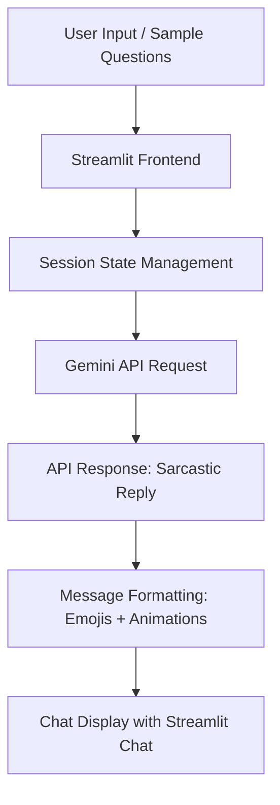

# 🧠 Sarcastic Self-Help Guru 🤖💬  
> "Therapy is expensive, my sarcasm is free."

A playful, sassy chatbot that roasts you while giving life advice. Built with Streamlit and Gemini API (Google AI), this app delivers hilarious, sarcastic, yet oddly insightful responses — with emojis, animations, sample prompts, and a sprinkle of attitude.


## 🚀 About the Project

We all love a good self-help tip… but let’s be honest, sometimes you just want someone to roast you while they motivate you.  
The idea behind this project was to build a chatbot that serves life advice with a bucketful of sarcasm, emojis, and attitude.  
It's like therapy, except sassier and way cheaper.

The chatbot is alive with animations, emojis, and clever banter. Whether you're asking, *"Why am I always broke?"* or *"Is my crush into me?"*, you'll get roasted, entertained, and (maybe) slightly enlightened.

---

## 🎨 Demo Video

[▶️ Click here to watch the Demo](https://www.youtube.com/watch?v=chbFbRaWtBs)

---

## 🛠️ Tech Stack

- **Python**: Core backend logic.
- **Streamlit**: For fast, interactive, and sleek web app UI.
- **Gemini API (Google AI)**: Generates sarcastic, witty replies.
- **Streamlit Chat Components**: Displays messages in chat format.
- **Custom CSS Styling**: Added fonts, animations, message styles.
- **GitHub Actions**: Automates deployment workflows.
- **.env & GitHub Secrets**: Secures API keys and sensitive info.

---

## 🔥 Features

- ✅ **Sarcastic AI Replies**: Funny, witty, and perfectly roasted responses.
- ✅ **Typing Indicator**: Shows "Guru is crafting your roast..."
- ✅ **Sample Questions**: Quick prompts to get you started.
- ✅ **Emoji Reactions**: Makes responses lively and relatable.
- ✅ **GitHub Actions**: Secure API key handling and CI/CD pipeline.

---

## 🧩 Architecture & Flow



- **Session State** manages chat history.
- **Gemini API** processes prompts and returns witty responses.
- **Frontend UI** styled with custom CSS & Streamlit components.

---

## 📂 Project Structure

```
📦 sarcastic-self-help-guru
├── .github/workflows/       # GitHub Actions workflow
├── .env                     # Local environment variables (excluded from repo)
├── app.py                   # Main Streamlit application
├── requirements.txt         # Python dependencies
├── sarcastic-chat-bot.mp4   # Demo video
├── README.md                # Project documentation
└── ...
```

---

## 🚧 Challenges Faced

- **Session Management**: Streamlit resets states often, maintaining chat flow required careful handling.
- **Dynamic Input Handling**: Balancing between sample questions and user inputs.
- **Deployment Secrets**: Keeping the API key safe in CI/CD using GitHub Secrets.
- **Response Styling**: Making AI responses short, funny, and emoji-rich consistently.
- **UX Improvements**: Adding animations, auto-scroll, and typing indicators.

---

## 🎓 What I Learned

- Mastered Streamlit components and advanced customizations.
- Built API request handling and real-time chat flow.
- Understood secure deployment with GitHub Actions and environment secrets.
- Improved UI/UX with CSS tweaks and animations.
- Learned the importance of session state for maintaining conversations.

---

## 🚀 Future Improvements

- 🎚️ Add Roast Meter: User-adjustable sarcasm intensity.
- 🎭 Add Sentiment Detector: Detect user sentiment and adjust replies accordingly.
- 🎉 Add Meme/GIF Reactions: Visual replies for extra sass.
- 🌐 Deploy Publicly: Live URL for public access.

---

## 📩 How to Run Locally

1. **Clone the repository**
```bash
git clone https://github.com/kriti613/sarcastic-self-help-guru.git
cd sarcastic-self-help-guru
```

2. **Install dependencies**
```bash
pip install -r requirements.txt
```

3. **Create `.env` file**
```bash
GOOGLE_API_KEY=your_gemini_api_key
```

4. **Run the app**
```bash
streamlit run app.py
```

---

## 🙌 Let's Connect!

If you enjoyed this project or have feedback, feel free to connect:

- 💼 [LinkedIn](https://www.linkedin.com/in/kriti-gupta-743599199/)
- 🐙 [GitHub](https://github.com/kriti613)
- 📩 Mail: kritigupta0613@gmail.com

---

## 🌟 Give it a Star!

If you found this project fun, consider giving it a ⭐️ on GitHub!

> **Made with ❤️, Python, and a little bit of sarcasm.**
